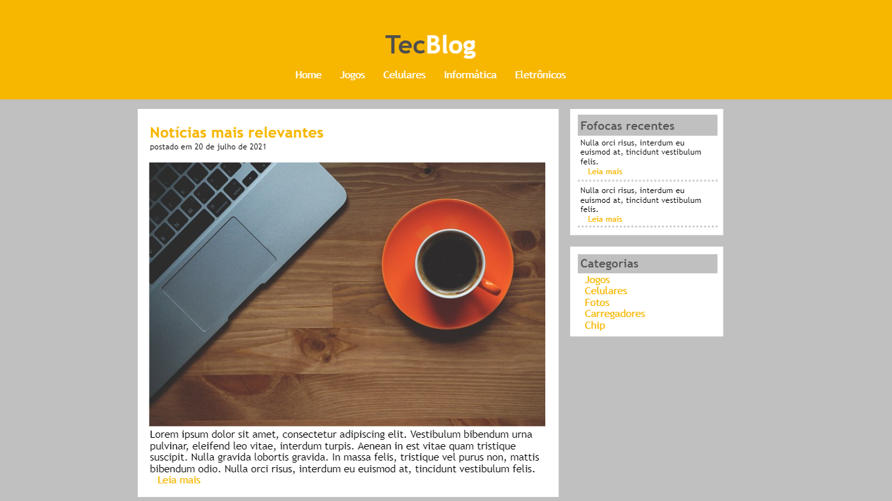

<h1> TecBlog</h1>
<h2> Blog fictício de notícias </h2>
<a href="https://liviaandressa.github.io/TecBlog/"> Link para a página completa do projeto </a>

<h2> Tecnologias usadas</h2>
<ul>
  <li> HTML5 </li>
  <li> CSS3 </li>
</ul>

